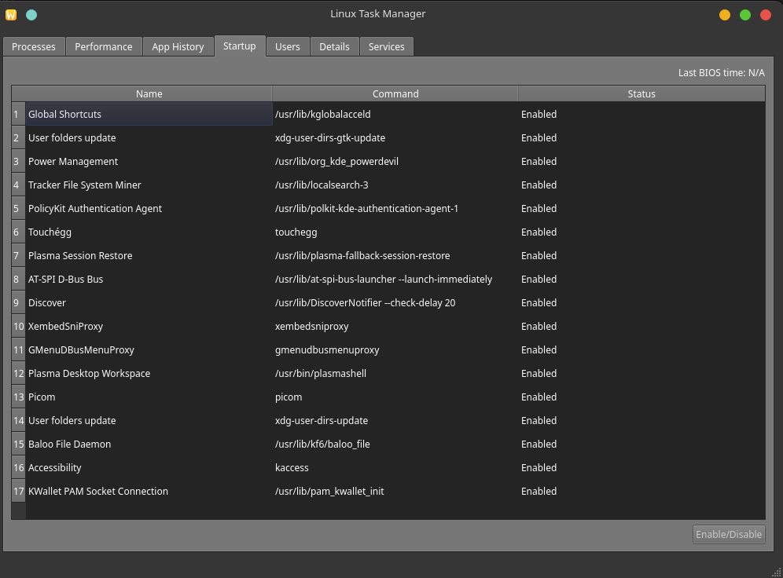
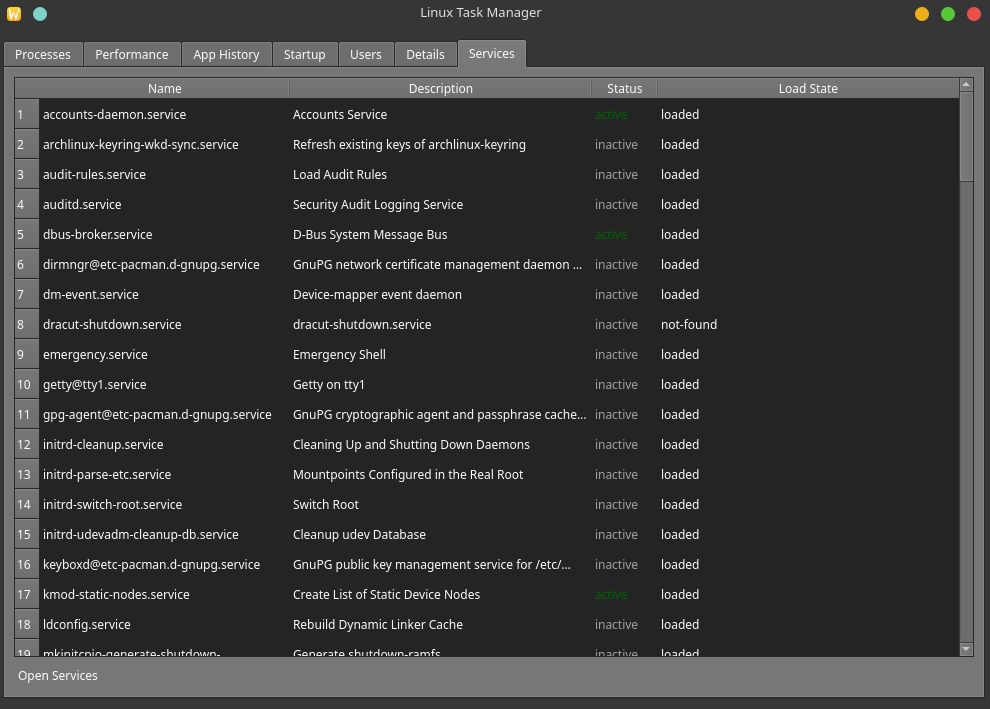

# Sawska's Task Manager

A graphical task manager for Linux, built with C++ and the Qt 5 framework. It provides a detailed, tabbed interface for monitoring system processes, performance, services, and more.


## Features

* **Process Management:** View a list of all running processes with details like PID, CPU usage, memory consumption, and owner.
* **Performance Monitoring:** Real-time graphs for:
    * Overall CPU Usage
    * Memory and Swap Usage
    * Disk I/O (Active Time, Read/Write Speed)
    * Network (Send/Receive)
* **Service Management:** List and view the status of systemd services.
* **Startup Applications:** View applications and services configured to run at startup.
* **User-Based Monitoring:** See resource consumption grouped by user.
* **Detailed Process View:** Inspect individual processes for more in-depth information.

## Dependencies

This project is built for **Linux** and relies on parsing the `/proc` filesystem.

To build it from source, you will need:
* **A C++ Compiler** (e.g., `g++`)
* **CMake** (version 3.10 or higher)
* **Qt 5** (specifically `Core`, `GUI`, and `Widgets`)

## How to Build and Run

1.  **Clone the repository:**
    ```bash
    git clone [https://github.com/](https://github.com/)[your-username]/Sawska-s-Task-manager.git
    cd Sawska-s-Task-manager
    ```

2.  **Install dependencies (Example for Debian/Ubuntu):**
    ```bash
    sudo apt update
    sudo apt install build-essential cmake qt5-default
    ```

3.  **Configure and build with CMake:**
    ```bash
    mkdir build
    cd build
    cmake ..
    make
    ```

4.  **Run the application:**
    The executable (named `GUITaskManager`) will


5. **Working examples:**





